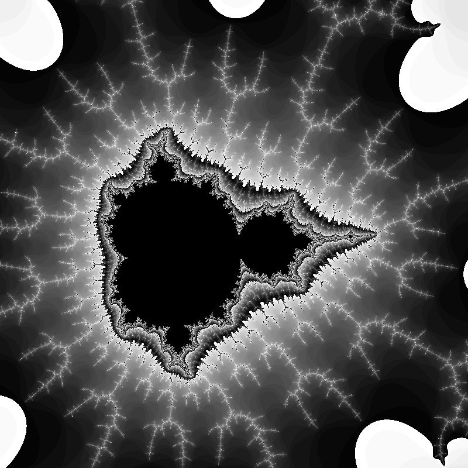

# Mandelbrot Explorer
---
A simple program for exploring and capturing the mandelbrot set.

## Controls

- Arrow keys (`←, ↑, →, ↓`) for moving around the image
- Use `space` and `left ctrl` to zoom in and out
- Brackets (`[, ]`) to change the number of iterations (detail)
- `R` to reset movement and zoom
- `S` to take a screenshot
- `I` to print information about current zoom, location, etc.

## Building

This project uses cmake. Simply run `cmake .` and build

### Dependencies:  
- SDL2 
- stb

## Screenshots

